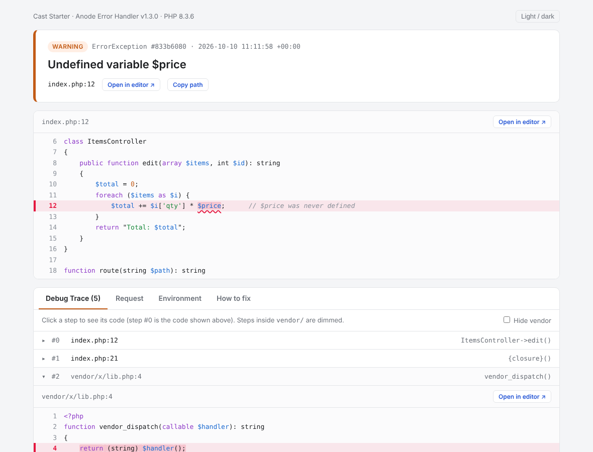
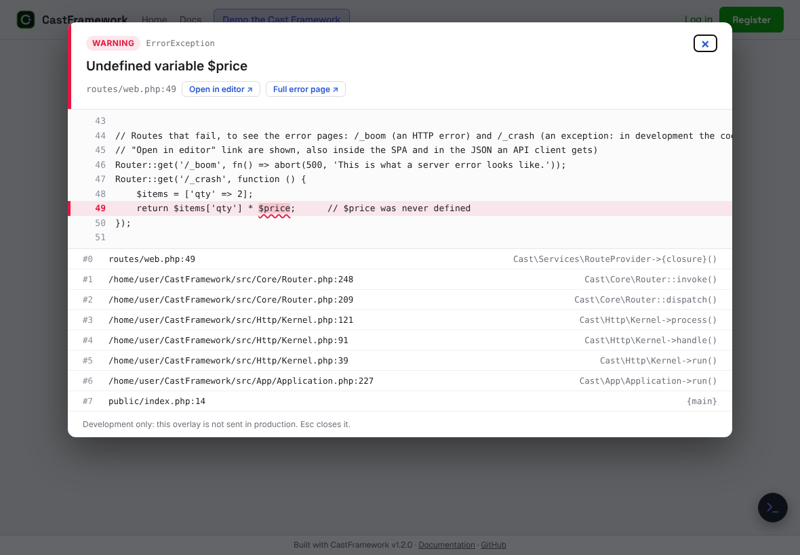

# Error handler

**Anode Error Handler** (`anode/error-handler`) is installed with the framework. On web requests `Cast\Services\ErrorProvider` creates it with
options taken from your config, and it then catches every PHP error, uncaught exception and fatal error, so a mistake becomes a readable page and a
log line instead of a blank screen. Its own README is at <https://github.com/arnoldduo2/error-handler>.

What it does:

- **Development** (`APP_ENV=development`): a detailed page (handler 1.3 and newer):
  - the message, its class, and **the code where it happened**, coloured, with the failing part **underlined in red** (an undefined variable, a missing function or method, an array key, a class that was not found, a division by zero; else the whole statement);
  - an **Open in editor** link next to every file and line, which opens the real file at that line (VS Code by default; `CAST_EDITOR=cursor|phpstorm|sublime|none`), like the source link of a browser console;
  - the **Debug Trace**: every step of the stack with its own code (click a step), `vendor/` steps dimmed;
  - the request (secrets hidden), the environment, and the exceptions it was caused by. It uses no CDN, so it works offline.
  - For errors inside a `.cast.php` view the code shown is the view's, at the view's line (template engine 1.0.3 and newer).
- **Production**: a plain "something went wrong" page for visitors and the details in the log. Never set `APP_DEBUG=true` in production.
- **Logging**: one readable file per day, `storage/logs/errors-YYYY-MM-DD.log`: each entry has the message, location, request, the failing code with a caret under the failing part, and the stack, with an id (`#833b6080`) that is also on the error page. `'log_format' => 'json'` writes one JSON object per line instead, `'log_style' => 'per_error'` the older one file per error. Optional separate developer logs and error e-mails (the e-mail carries the readable entry).
- **Ajax, Cast and API requests** get JSON, not HTML. The framework also answers HTTP errors itself (404, 403, 405, 419, 503) with its own pages:
  these are not PHP errors, so the handler is not involved.



## Configure it

`php cast init` asks whether to use it (and shows every setting with its default). Later:

```bash
php cast make:config error-handler        # writes config/error-handler.php with every option and its default
```

```php
// config/error-handler.php (the file wins over config/app.php 'error_handler' => [...])
return [
    'enabled' => true,                     // false: do not register it at all
    'log_errors' => true,
    'log_directory' => 'storage/logs/',    // folders are relative to the app
    'dev_logs' => false,                   // extra, more detailed logs
    'dev_logs_directory' => 'storage/logs/dev/',
    'display_errors' => false,             // leave off: the handler shows its own page
    'error_reporting_level' => E_ALL,
    'email_logging' => false,              // e-mail errors; needs an object with a send() method
    'email_logging_address' => '',
    'email_logging_subject' => 'Error Log',
    'log_style' => 'daily',                // daily | per_error
    'log_format' => 'text',                // text | json
    'log_code_lines' => 3,                 // lines of code kept in a log entry around the failing line
    'editor' => 'vscode',                  // vscode | cursor | phpstorm | sublime | none (env CAST_EDITOR)
    'editor_path_map' => [],               // Docker / WSL: ['/var/www/html' => 'C:/xampp/htdocs/app']
    'snippet_lines' => 6,                  // lines of code shown around the failing line
    'error_view' => null,                  // your own 500 page (a PHP file); null = the handler's
];
```

The framework fills in `app_name`, `app_debug`, `app_enviroment` (sic, the package's spelling), `base_url`, `log_directory`, `root_path` (so paths are short) and `editor` from your `.env`
(`APP_NAME`, `APP_DEBUG`, `APP_ENV`, `APP_BASE_PATH`); you only list what differs. `'error_handler' => false` in `config/app.php` turns it off.
With it off, PHP's own handling applies: use it only if another tool (Sentry, Whoops) takes over.

## Error pages of your own

HTTP error pages are views: create `resources/views/errors/404.cast.php` (or `403`, `405`, `419`, `500`, `503`, or `error.cast.php` for all) and
yours replaces the framework's; an **empty** file means "not built yet", so the framework page shows and, in development, says which view you still
have to write. `php cast init` can create the empty ones (`--error-pages=custom`). The page the handler shows for a 500 in production is
`error_view`.

## In the SPA and with a front-end framework

A browser page gets the full error page above. A Cast (SPA) page or a React / Vue / Next.js front end never navigates to a failing request: it gets JSON, so the server sends the same details **inside the JSON, in development only**:

```json
{
  "status": "error",
  "msg": "Undefined variable $price",
  "data": {
    "type": "error", "code": 500,
    "debug": {
      "id": "a11a4802", "kind": "ErrorException", "severity": "WARNING",
      "message": "Undefined variable $price",
      "file": "app/Controllers/ItemsController.php", "line": 49,
      "editor": "vscode://file//home/me/shop/app/Controllers/ItemsController.php:49:1",
      "url": "http://localhost:8000/cast/error/a11a4802",
      "code": [{ "n": 48, "text": "    $items = ['qty' => 2];", "error": false }, { "n": 49, "text": "    return $items['qty'] * $price;", "error": true }],
      "focus": [30, 6],
      "trace": [{ "index": 0, "file": "app/Controllers/ItemsController.php", "line": 49, "context": "App\\Controllers\\ItemsController->edit()", "app": true, "editor": "vscode://..." }]
    }
  }
}
```



- **Cast (SPA) pages:** the client shows an **overlay** on top of the page (a failing form submit or navigation too): the message, the code with the failing part underlined, *Open in editor*, *Full error page* and the stack. Esc closes it; the page underneath stays as it was. Nothing to set up. (`CAST_EDITOR` chooses the editor.)
- **Closed it? The error is not lost.** The overlay remembers the errors of the tab (the last 25; the same error twice is one entry with `×2`). The floating **Cast dock** (bottom right) shows a **red count** on its button, lists the errors in its menu (click one to open it again) and has *Clear errors*. Where there is no dock (a front end of your own), a small **"N errors — open"** button appears in the same corner (× forgets them). `CastErrorOverlay.errors()` and `.clear()` do the same from code, and the window event `cast:dev-errors` fires whenever the list changes.
- **A front end of your own** (React, Vue, Next.js, Svelte ...): the same overlay is one script, served by the framework, that you can load while developing, or you can read `data.debug` and draw your own:

```html
<script src="http://localhost:8000/cast/error-overlay.js"></script>   <!-- development only -->
```

```js
const res = await fetch("http://localhost:8000/api/items", { headers: { Accept: "application/json" } });
const body = await res.json();
if (body.status === "error" && body.data?.debug) window.CastErrorOverlay.show(body.data.debug);   // the overlay
// or: console.error(body.data.debug.message, body.data.debug.file + ":" + body.data.debug.line); window.open(body.data.debug.url);
```

  In a Vite or Next.js app put the `<script>` in `index.html` / the root layout behind `import.meta.env.DEV` / `process.env.NODE_ENV === 'development'`, so it never ships. The overlay lives in a shadow root (your CSS cannot break it) and inserts everything as text.
- **`url`** opens the same full page the browser would have shown (all stack steps with their code, the request, the environment): `GET /cast/error/<id>`. The server keeps the last 25 reports in `storage/framework/errors/` for this, and serves the page only in development. The page and the editor links need error handler 1.3; with an older one `debug` still has the message, file, line, code and stack.
- **Production:** none of this exists. `APP_ENV=production`, or `APP_DEBUG=false`, answers with the generic message and no `debug`, and `/cast/error/<id>` is a 404. (`APP_DEBUG=true` in production would show the message: never set it.)
- **Fatal errors** (memory exhausted, a compile error in a view) and errors inside a `.cast.php` view reach SPA and API clients the same way.

## In practice

- A fatal error in a Cast or API request ends with the JSON envelope `{status: "error", msg, data}` and exit code 1; browsers get the handler's page.
- Logs are plain text: `tail -f storage/logs/errors-<date>.log` while you work; `php cast deploy:check` checks that `storage/` is writable and debug is off.
- `php cast env:check` warns when the installed handler is older than the version the framework was tested with (1.3.0).
- Check the version with `composer show anode/error-handler`; update with `composer update anode/error-handler`.
